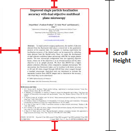
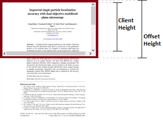

Infinite Gallery as the name suggest, gallery which has infinite images and which can be scrolled infinitely.
Infinite Images really !!!😱
Well,😅 i know its not true, the thing is, i created an illusion which seems like user can scrolled infinitely without having any end.
In this project i showed how an infinite scroll can be made. Well there are also few library on the internet which perform infinite scrolling very well and efficient. But its always better to understand the logic behind any thing, and in this case the logic seems to be little bit complicated but the truth is its not.
In Infinite scrolling website upload the data as the user keep scrolling, if we skip infinite scroll the webpage will load all the data at a time (which can take a good time depends on amount of the data is going to be loaded).This type of scrolling is useful when the webpage has large amount of data or loadind data from internet which can take a good time if all the data load at onces. Infinte scrolling aid the user to keep viewing or reading the data while the rest of data is being loaded. Its kind of asynchronous where user keep reading the front data and web page is loading the rest data as user scrolling down.
The logic of creating infinite scroll is depend on 3 things:-
1) scrollTop :- The scrollTop property sets or returns the number of pixels an element's content is scrolled vertically.
2) clientHeight :- VISIBLE content & padding , Only visible height: content portion limited by explicitly defined height of the element.
3) scrollHeight :- ENTIRE  content & padding (visible or not) Height of all content + paddings, despite of height of the element.

   

Logic which i used in my project:-

if(this.ScrollRef.current.scrollTop+this.ScrollRef.current.clientHeight>=this.ScrollRef.current.scrollHeight-20)
{     LoadMoreContent}
     
Now the question is why i subtract scrollHeight by 20? 😕 
Remeber one thing always start loading the content when the scrollbar is about to reach the end of the scrollbar because if webpage load   the content when the scrollbar is at the end, the user have to wait for sometime, that's why i start loading the content as my scrollbar   is 20 magnitude above from the end point of scrollbar. As webpage also get time to load the content and user doesn't have to wait and     keep scrolling 
